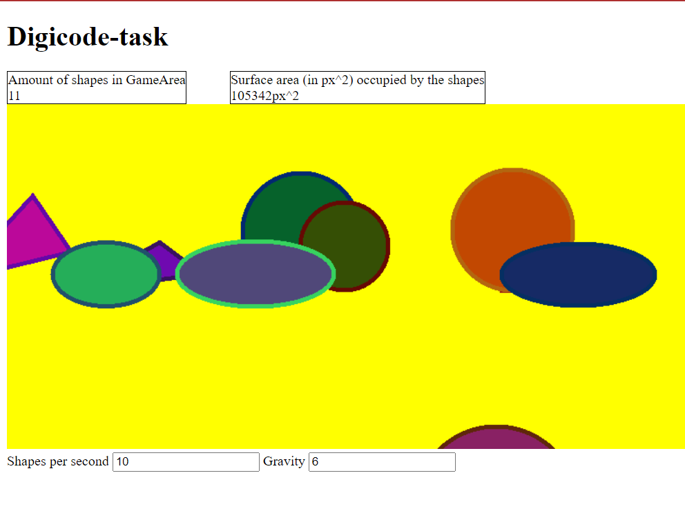

## Getting started

1. Clone the repository
```
git clone https://github.com/Karabinskiy13/Pixi-MVC
```
2. Install all dependencies
```
npm install
```
3. Build the project and open ```index.html``` file in browser
```
npm start
```

